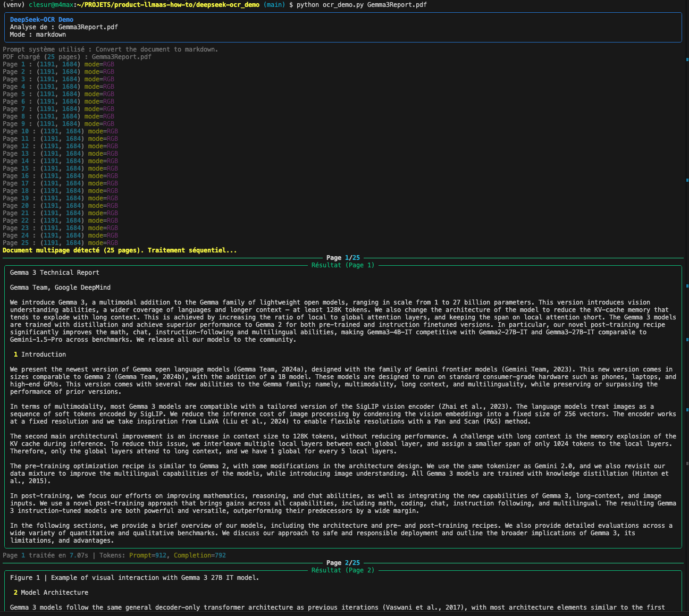
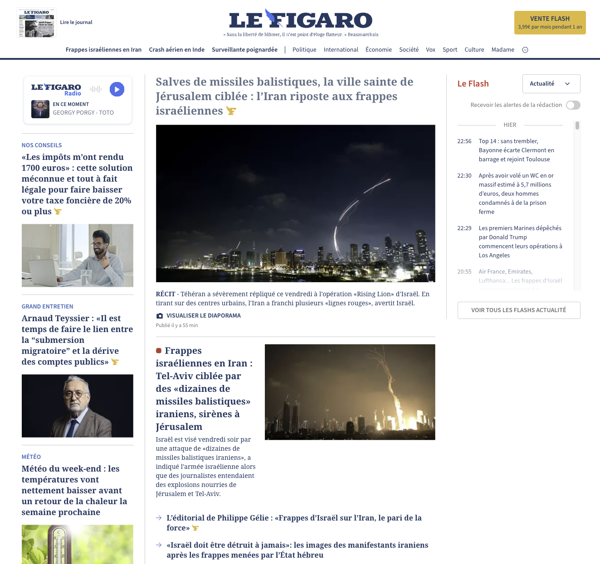
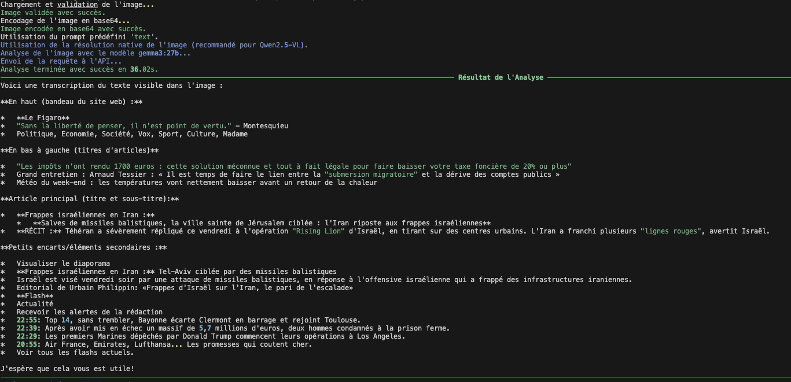
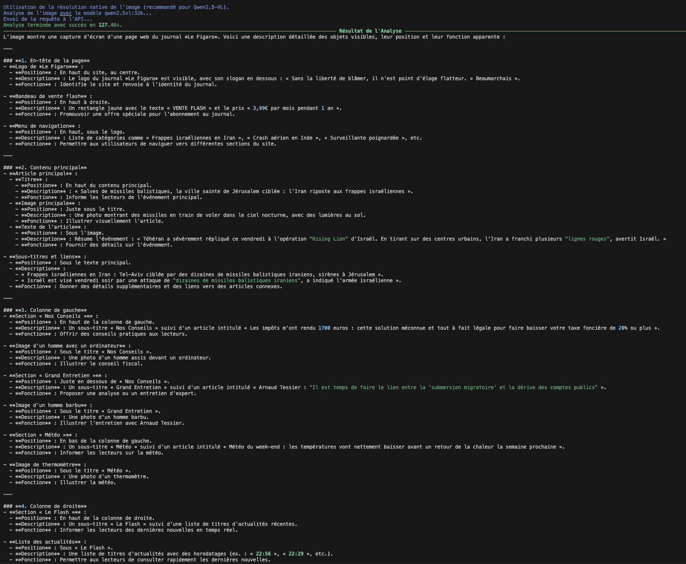
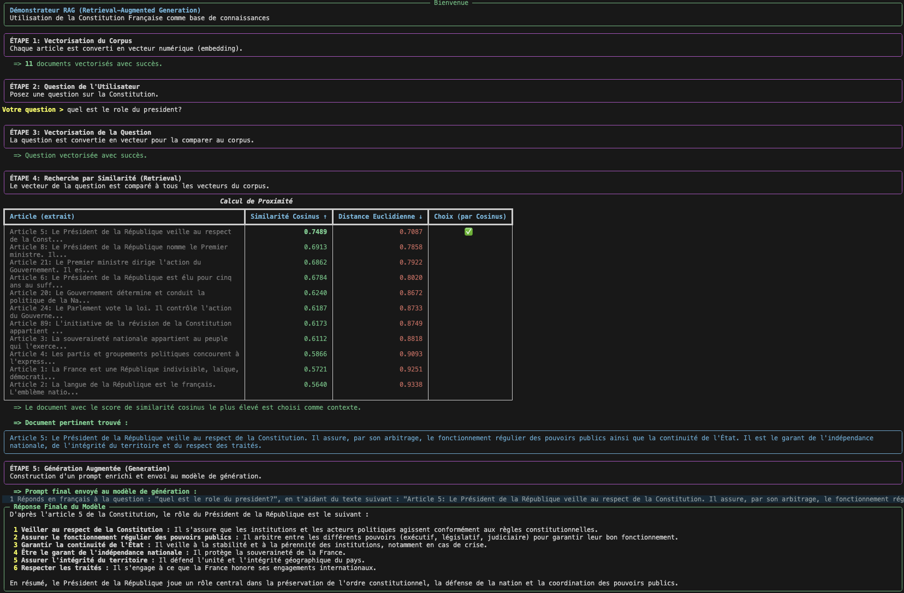

# Cas d'Usage LLM as a Service - Cloud Temple

Ce répertoire contient une collection d'exemples de code et de scripts démontrant les différentes fonctionnalités et cas d'utilisation de **l'offre LLM as a Service (LLMaaS) de Cloud Temple**.

## 🆕 Changelog - Dernières Nouveautés

### Version 3.0.0 - 26 Janvier 2026

#### 💬 **Mini-Chat v3.0 - Refonte Architecturale Majeure**
- 🏗️ **Architecture Modulaire** : Refonte complète du code (`Service`, `State`, `Config`, `CLI`) pour une robustesse et une maintenabilité maximales.
- 🧠 **RAG Avancé & Stable** : Pipeline RAG entièrement validé (Ingestion -> Qdrant -> Génération) avec gestion automatique des collections.
- 🛠️ **Tool Calling Fiable** : Correction des problèmes de streaming avec les outils (calculatrice, shell, etc.) grâce à une gestion fine des chunks JSON.
- ⚡ **Modèle par Défaut** : Passage à `openai/gpt-oss-120b` pour des performances conversationnelles optimales.
- 🧪 **Tests Automatisés** : Ajout d'un script de scénario de test (`test_rag_scenario.py`) pour valider la configuration RAG en un clic.

#### 📸 **PhotoAnalyzer - Support Qwen3 VL & Omni**
- 🤖 **Modèles Multimodaux SOTA** : Intégration et validation des modèles **Qwen3-VL** (8b, 30b) et **Qwen3-Omni**.
- 🔌 **Standardisation API** : Mise à jour du client pour utiliser le format standard `image_url`, assurant une compatibilité maximale.
- 📝 **Documentation Enrichie** : Guide d'utilisation mis à jour avec des exemples spécifiques pour les nouveaux modèles.

#### 🧠 **Qwen-Omni - Capacités Multimodales Natives**
- 🚀 **Nouvel Exemple** : Ajout d'une démonstration dédiée (`qwen_omni_demo`) illustrant les capacités de compréhension simultanée du texte et des images.
- ✨ **Performance** : Temps de réponse ultra-rapides et compréhension contextuelle de haut niveau.

#### 🏥 **MedGemma - Analyse d'Images Médicales**
- 🧬 **Spécialisation** : Validation et mise à jour bilingue de l'exemple d'analyse d'imagerie médicale (radio, scanner) via le modèle expert `medgemma:27b`.

#### 🔌 **Simple MCP Demo - Protocole MCP Sécurisé**
- 🌐 **Architecture Distribuée** : Implémentation de référence du Model Context Protocol (MCP) sur HTTP/SSE.
- 🔒 **Sécurité Renforcée** : Authentification par clé API via middleware ASGI pur.
- 🐳 **Docker Ready** : Déploiement simplifié du serveur MCP via Docker Compose.
- 🐛 **Debug & Pédagogie** : Logs détaillés du protocole JSON-RPC et documentation du flux de session SSE.

#### 📊 **Status API Demo - Dashboard & Énergie**
- 📈 **Monitoring en Temps Réel** : Création d'un tableau de bord pour surveiller l'état de santé de la plateforme et les performances des modèles (TTFB, tok/s).
- ⚡ **Energy Map Officielle** : Intégration des coefficients de consommation énergétique réels (kWh/Mtoken) mis à jour au 26/01/2026.

### Version 2.2.1 - 25 Janvier 2026

#### 🔍 **GetFact - Robustesse JSON & max_tokens 16k**
- 🧱 **Gestion des réponses tronquées** : meilleure résistance aux sorties incomplètes (`finish_reason=length`) grâce à des consignes JSON-only et une stratégie de retry.
- 🔢 **Limite de génération augmentée** : valeur par défaut portée à **16384 tokens** (config `.env` / `.env.example`) pour réduire la probabilité de troncature sur des chunks denses.
- 🧠 **Ontologies Métiers** : Documentation détaillée des 6 ontologies prêtes à l'emploi (Droit, RH, DevOps, Sécurité, Infrastructure, Infogérance).

#### 🌐 **Translate - Traduction de documents volumineux**
- 📅 **Date et Version** : Script mis à jour au 25/01/2026 (v1.2.1).
- 🧩 **Chunking Intelligent** : Algorithme de découpage respectant les structures de paragraphes et de phrases pour maintenir le sens.
- 💎 **Support TranslateGemma** : Format de prompt spécifique et paramètres optimisés pour les modèles Google TranslateGemma.
- 🔗 **Cohérence Contextuelle** : Système de contexte glissant entre les chunks pour une traduction homogène du début à la fin du document.
- ✍️ **Documentation** : Commentaires didactiques ajoutés pour expliquer les flux asynchrones et la gestion des langues ISO.

### Version 2.2.0 - Novembre 2025

#### 👁️ **DeepSeek-OCR - Vision & Extraction** ✨ *NOUVEL EXEMPLE*
- 📄 **Conversion Markdown structurée** : Transforme n'importe quel document (PDF, image) en Markdown propre (tableaux, titres)
- 🧮 **Support Mathématiques** : Transcription précise des formules en LaTeX
- 📑 **Traitement PDF multipages** : Conversion page par page des documents longs
- 🖼️ **Optimisation intelligente** : Prétraitement des images (zoom, conversion RGB) pour une lisibilité maximale

### Version 2.1.0 - Juillet 2025

#### 🔍 **GetFact - Extracteur de Faits**
- ✨ **Support des modèles raisonneurs** : Gestion automatique des réponses incluant des blocs de pensée (`<think>...</think>`)
- 🛠️ **Parsing JSON robuste** : Extraction fiable du contenu JSON même depuis des réponses malformées
- 🐛 **Mode debug avancé** : Logs détaillés incluant le découpage précis, les payloads JSON complets et les réponses brutes de l'API


#### 🎵 **Transkryptor - Transcription Audio**
- 🔄 **Résilience aux erreurs** : Mécanisme de retry avec backoff exponentiel pour une meilleure stabilité
- ✨ **Raffinement de transcription (`--rework`)** : Nouvelle option pour améliorer la transcription via un modèle de langage
- 📄 **Script `rework-only.py`** : Nouveau script dédié pour raffiner des fichiers texte existants
- 🔗 **Contexte continu (`--rework-follow`)** : Maintien du contexte entre les lots pour une meilleure cohérence
- � **Recommandations de qualité** : Configuration optimale basée sur des tests (20s pour contenu complexe, 10s pour dialogues)
- 📦 **Dépendances étendues** : Ajout de `tiktoken` et `langchain-text-splitters` pour un meilleur découpage

#### 📝 **Summarizer - Synthèse de Texte** ✨ *NOUVEL OUTIL*
- 🆕 **Outil complet de synthèse** : Nouveau script pour générer des synthèses précises de fichiers texte ou Markdown de n'importe quelle taille
- 🧩 **Découpage intelligent par tokens** : Utilise `tiktoken` pour un découpage précis respectant les limites des modèles
- ⚡ **Traitement parallèle par lots** : Optimisation de la vitesse avec traitement simultané des chunks
- 🔗 **Continuité contextuelle** : Maintien du contexte entre les sections pour une synthèse cohérente
- 📝 **Prompts configurables** : Support de différents types de synthèse (concis, détaillé, points d'action, Q&A)
- 📖 **Documentation complète** : README français et anglais avec exemples d'usage détaillés

#### 📚 **Exemples RAG (Retrieval-Augmented Generation)** ✨ *NOUVEAUX EXEMPLES*
- 🆕 **Simple RAG Demo** : Un script pédagogique pour comprendre les mécanismes de base du RAG avec des vecteurs en mémoire.
- 🆕 **RAG with Qdrant Demo** : Un exemple complet et conteneurisé utilisant Qdrant comme base de données vectorielle pour des applications RAG plus robustes.

#### 💬 **Mini-Chat - Chat avec RAG et Outils**
- 🧠 **Support RAG complet** : Intégration avec la base vectorielle Qdrant pour des réponses augmentées par vos documents.
- 🛠️ **Outils intégrés** : Inclut calculatrice, horloge, accès aux fichiers, exécution de commandes shell et recherche RAG.
- ⚙️ **Interface en ligne de commande avancée** : Autocomplétion, historique persistant, et gestion fine des sessions.
- 🚀 **Architecture v3.0** : Refonte complète avec architecture modulaire robuste, gestion d'erreurs avancée et modèle par défaut `gpt-oss-120b`.

---

## À propos de LLMaaS Cloud Temple

L'API LLMaaS de Cloud Temple vous permet d'intégrer facilement des modèles de langage dans vos applications. Elle est accessible via la Console Cloud Temple où vous pouvez gérer vos clés API, surveiller votre consommation et configurer vos paramètres.

### Accès rapide à l'API

- **URL de base** : `https://api.ai.cloud-temple.com/v1/`
- **Authentification** : Header `Authorization: Bearer YOUR_API_KEY`
- **Format** : JSON (`Content-Type: application/json`)

### Endpoints principaux

- `/chat/completions` : Génération de réponses conversationnelles
- `/completions` : Complétion de texte simple  
- `/models` : Liste des modèles disponibles

### Exemple de requête cURL

```bash
curl -X POST "https://api.ai.cloud-temple.com/v1/chat/completions" \
  -H "Content-Type: application/json" \
  -H "Authorization: Bearer YOUR_API_KEY" \
  -d '{
    "model": "granite3.3:8b",
    "messages": [
      {
        "role": "user", 
        "content": "Salut ! Peux-tu te présenter en français ?"
      }
    ],
    "max_tokens": 200,
    "temperature": 0.7
  }'
```

### Paramètres disponibles

| Paramètre     | Type    | Description                               |
| ------------- | ------- | ----------------------------------------- |
| `model`       | string  | Le modèle à utiliser                      |
| `messages`    | array   | Liste des messages de la conversation     |
| `max_tokens`  | integer | Nombre maximum de tokens à générer        |
| `temperature` | float   | Contrôle la créativité (0.0-2.0)          |
| `top_p`       | float   | Contrôle la diversité des réponses        |
| `stream`      | boolean | Active le streaming de la réponse         |
| `user`        | string  | Identifiant unique de l'utilisateur final |

## Structure des Exemples

Chaque exemple est organisé dans son propre sous-répertoire avec :
- Un fichier README.md expliquant l'objectif et le fonctionnement
- Les fichiers de code source nécessaires  
- Les fichiers de configuration (`.env.example`, `config.example.json`)
- Les données d'exemple le cas échéant

## 📸 Aperçu Visuel

Découvrez les capacités de l'API LLMaaS Cloud Temple à travers ces captures d'écran des exemples en action :

### 👁️ DeepSeek-OCR Vision & Extraction

*Conversion d'un document complexe (PDF/Image) en Markdown structuré, préservant tableaux et mise en forme*

### 🚀 Streaming en Temps Réel

*Démonstration du streaming SSE avec affichage token par token et métriques de performance en temps réel*

### 💬 Interface Chat Interactive

*Interface de chat en ligne de commande avec sélection de modèle et configuration des paramètres*


*Conversation en cours avec l'assistant IA, affichage des tokens et statistiques de performance*


*Utilisation d'outils intégrés (calculatrice, lecture de fichiers, commandes shell) dans le chat*

### 🎵 Transcription Audio Avancée

*Interface de transcription audio avec barre de progression et prévisualisation en temps réel*


*Résultats de transcription avec découpage intelligent et traitement par lots parallèles*

### 📸 Analyse d'Images Multimodale

*Image originale d'un journal pour l'analyse multimodale*


*Première vision du modèle sur l'image du journal*


*Deuxième vision du modèle sur l'image du journal*

### 📚 Démonstration RAG Simple

*Exécution du script RAG simple, montrant les étapes de vectorisation, recherche et génération augmentée*

## Exemples Disponibles

### 👁️ [DeepSeek-OCR Demo](./deepseek-ocr_demo/)
Démonstration de la puissance du modèle DeepSeek-OCR (Janus-Pro) pour la conversion intelligente de documents visuels. Contrairement aux OCR classiques, il comprend la structure du document : tableaux complexes, hiérarchie des titres et formules mathématiques sont préservés et convertis en Markdown structuré. Supporte les images et les PDF multipages.

### 🧠 [Qwen-Omni Demo](./qwen_omni_demo/)
Exemple d'utilisation du nouveau modèle **Qwen3-Omni**, fleuron de la multimodalité native. Ce modèle est capable de traiter et de raisonner simultanément sur des entrées complexes mêlant texte et vision avec une fluidité exceptionnelle et une précision accrue sur les détails visuels.

### 🏥 [MedGemma Analysis](./medgemma_analysis/)
Utilisation du modèle spécialisé **MedGemma** pour l'analyse d'imagerie médicale. Cet exemple démontre comment l'IA peut assister les professionnels de santé dans la description de structures anatomiques et l'identification d'anomalies potentielles à partir de radios ou de scanners.

### 📸 [PhotoAnalyzer](./photoanalyzer/)
PhotoAnalyzer est un outil CLI Python avancé pour l'analyse d'images utilisant l'API LLMaaS avec des modèles multimodaux. Il offre une interface utilisateur soignée avec modes debug, formats de sortie multiples, et support de différents types de prompts d'analyse spécialisés.

### 🔍 [GetFact](./getfact/) 
Extracteur de faits et relations intelligent utilisant l'API LLMaaS. Capable d'extraire automatiquement entités, événements, relations, attributs, informations temporelles et spatiales d'un texte. Supporte les ontologies métier spécialisées (Droit, RH, DevOps, Sécurité, Infrastructure, Infogérance) pour une extraction contextuelle optimisée.

### 📝 [Summarizer](./summarizer/)
Outil de synthèse de texte avancé utilisant l'API LLMaaS. Génère des synthèses précises de fichiers texte ou Markdown de n'importe quelle taille avec découpage intelligent par tokens, traitement parallèle par lots, et continuité contextuelle entre les sections.

### 📚 [Simple RAG Demo](./simple_rag_demo/)
Démonstrateur RAG pédagogique pour illustrer le fonctionnement du Retrieval-Augmented Generation. Utilise l'API LLMaaS pour l'embedding et la génération, avec stockage des vecteurs en mémoire pour une compréhension claire du processus.

### 📚 [RAG with Qdrant Demo](./rag-granite-qdrant-demo/)
Démonstrateur RAG complet et conteneurisé utilisant Qdrant comme base de données vectorielle. L'API LLMaaS est utilisée pour l'embedding des documents et la génération de réponses augmentées.

### 📝 [List Models](./list_models/)
Script avancé pour lister tous les modèles disponibles via l'API LLMaaS avec leurs détails, spécifications et statuts. Le script inclut une catégorisation fonctionnelle des modèles (Langage Généraliste, Embedding, Vision, OCR, etc.) pour faciliter leur sélection selon l'usage prévu.

### 🚀 [Streaming Demo](./streaming-demo/)
Exemple minimal pour démontrer le streaming en temps réel avec l'API LLMaaS. Montre l'activation du streaming SSE (Server-Sent Events), l'affichage token par token, et le calcul des métriques de performance.

### 💬 [Mini Chat](./mini-chat/)
Client de chat en ligne de commande interactif (v3.0) refondu pour une stabilité maximale. Il supporte non seulement les conversations standards avec les modèles LLM, mais intègre également un **système RAG complet** via Qdrant et **des outils intégrés** (calculatrice, shell, gestion de fichiers, etc.). Cette nouvelle version offre une architecture modulaire et une gestion robuste des tool calls en streaming.

### 📊 [Status API Demo](./status_api_demo/)
Script de démonstration pour l'API publique de statut de la plateforme. Il permet de surveiller l'état de santé global de LLMaaS, de récupérer les métriques de performance en temps réel (TTFB, débit) et d'estimer précisément la consommation énergétique des requêtes par modèle.

### 🧪 [Test API Models](./test_api_models/)
Script Python pour tester et comparer des modèles LLM via API avec configuration externe, découverte dynamique, sélection de modèles, gestion d'erreurs et résumé des performances.

### 🧪 [Test API Models PowerShell](./test_api_models_powershell/)
Version PowerShell du script de test des modèles, similaire à la version Python mais adaptée aux environnements Windows.

### 🎤 [Whisper](./whisper/)
Exemple d'utilisation de l'API de transcription audio (ASR) avec client Python, démontrant la conversion audio vers texte.

### 🌐 [Translate](./translate/)
Script Python pour traduire des fichiers texte par segments, utilisant un modèle LLM et conservant le contexte entre les segments pour des traductions cohérentes.

### 🎵 [Transkryptor](./transkryptor/)
Outil CLI Python avancé pour la transcription de fichiers audio volumineux, utilisant le découpage intelligent, le traitement par lots parallèles, la normalisation audio et une interface utilisateur soignée.

### 🐣 [Exemples Pédagogiques (Simples)](./)
Série d'exemples minimalistes conçus pour apprendre à utiliser les fonctions de base de l'API :
- **[Simple RAG Demo](./simple_rag_demo/)** : Les bases du RAG avec vecteurs en mémoire.
- **[Simple Tool Calling](./simple_tool_calling/)** : Comment connecter le LLM à une fonction Python (calculatrice).
- **[Simple Vision](./simple_vision/)** : Analyse d'image basique avec des modèles multimodaux.
- **[Simple TTS](./simple_tts/)** : Synthèse vocale rapide et lecture audio.
- **[Simple Translate](./simple_translate/)** : Traduction de texte optimisée avec TranslateGemma.
- **[Simple MCP Demo](./simple_mcp_demo/)** : Utilisation du Model Context Protocol (MCP) en architecture distribuée HTTP/SSE sécurisée.

## Configuration

Chaque exemple inclut un fichier `.env.example` que vous devez copier vers `.env` et remplir avec vos paramètres :

```bash
# Dans chaque dossier d'exemple
cp .env.example .env
# Éditez .env avec votre clé API Cloud Temple
```

## Prérequis

- Python 3.7+
- Clé API LLMaaS Cloud Temple
- Accès à la Console Cloud Temple

## Support

Pour toute question concernant l'API LLMaaS Cloud Temple, consultez la documentation officielle ou contactez le support Cloud Temple.

📖 **Documentation complète** : [docs.cloud-temple.com](https://docs.cloud-temple.com)

## Licence

Ces outils sont sous licence GPL 3.0 - voir le fichier [LICENSE](LICENSE) pour plus de détails.
