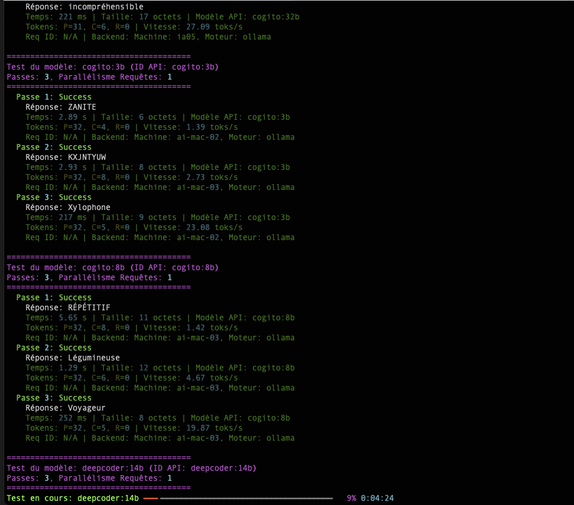
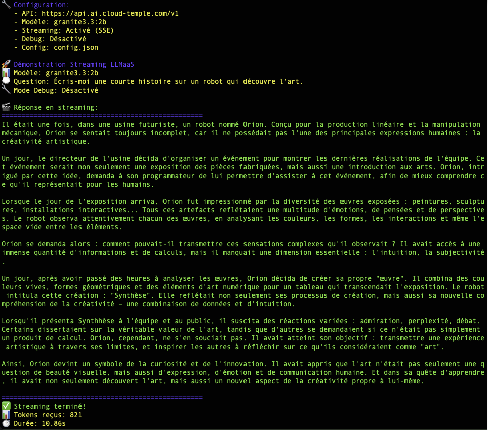
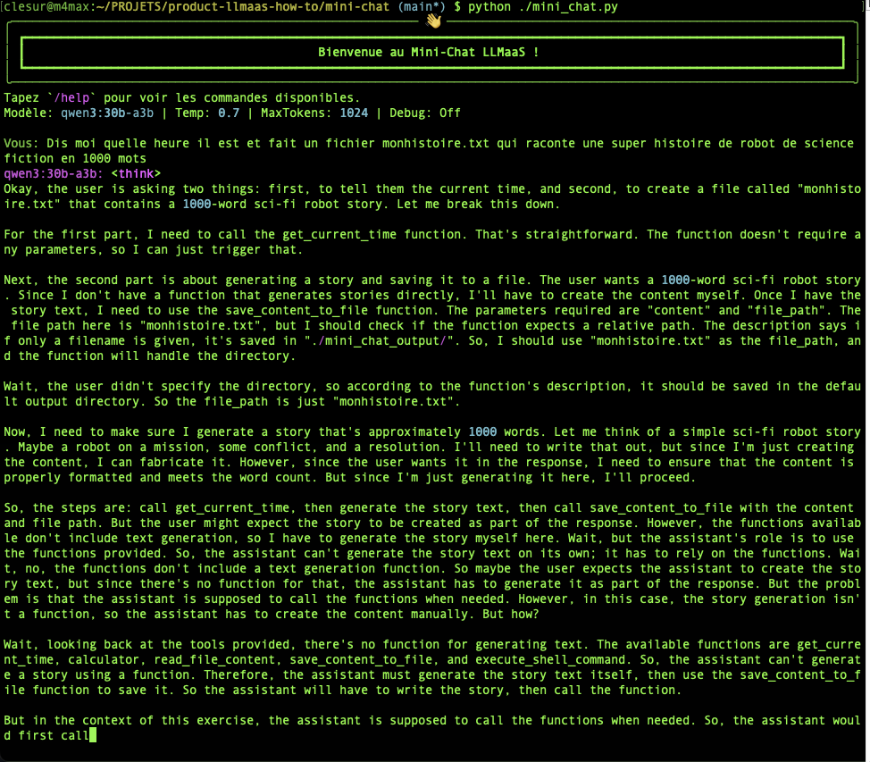
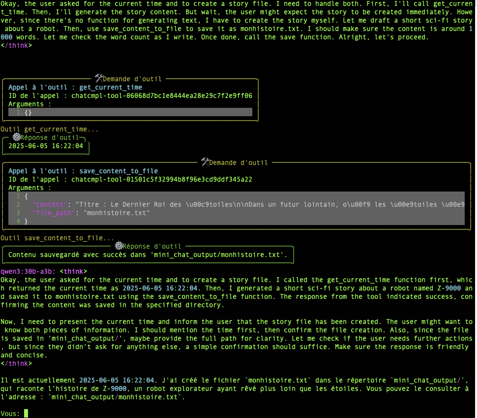
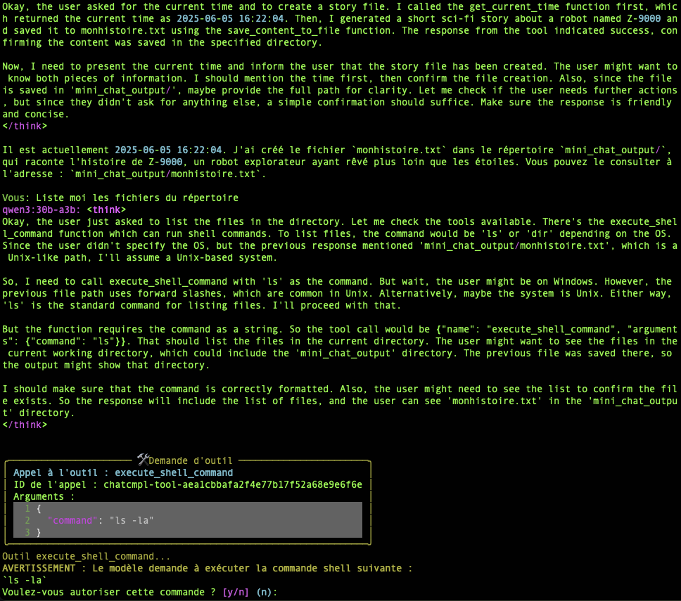
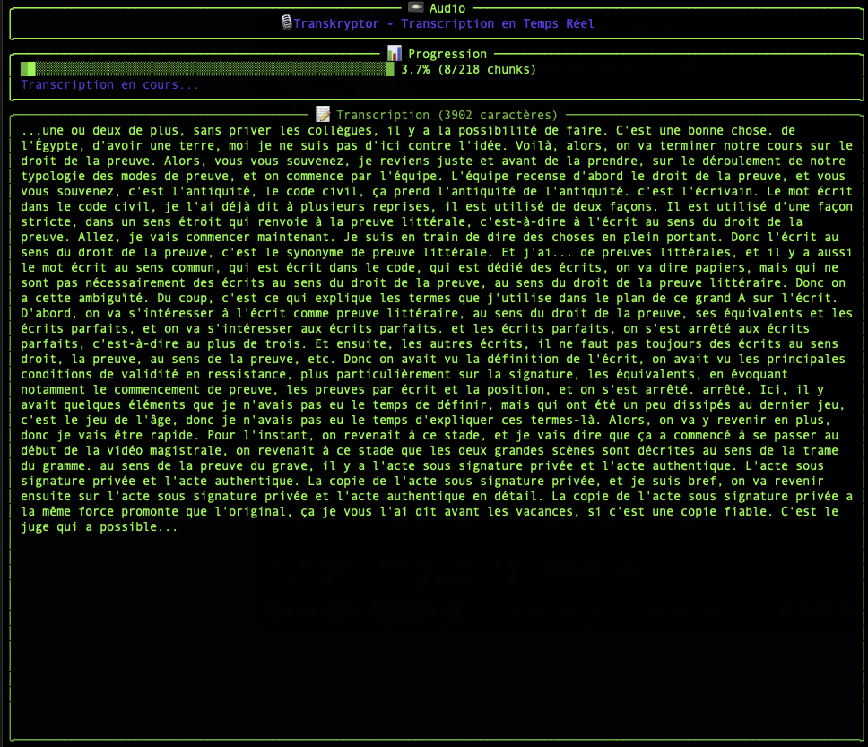
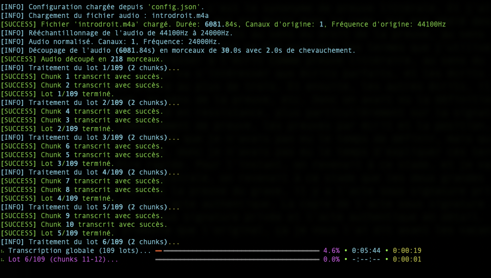

# LLM as a Service (LLMaaS) Use Cases - Cloud Temple

This repository contains a collection of code examples and scripts demonstrating the various features and use cases of **Cloud Temple's LLM as a Service (LLMaaS) offering**.

## About Cloud Temple LLMaaS

Cloud Temple's LLMaaS API allows you to easily integrate language models into your applications. It is accessible via the Cloud Temple Console where you can manage your API keys, monitor your consumption, and configure your settings.

### Quick API Access

- **Base URL**: `https://api.ai.cloud-temple.com/v1/`
- **Authentication**: `Authorization: Bearer YOUR_API_KEY` Header
- **Format**: JSON (`Content-Type: application/json`)

### Main Endpoints

- `/chat/completions`: Conversational response generation
- `/completions`: Simple text completion
- `/models`: List of available models

### cURL Request Example

```bash
curl -X POST "https://api.ai.cloud-temple.com/v1/chat/completions" \
  -H "Content-Type: application/json" \
  -H "Authorization: Bearer YOUR_API_KEY" \
  -d '{
    "model": "granite3.3:8b",
    "messages": [
      {
        "role": "user", 
        "content": "Hello! Can you introduce yourself in French?"
      }
    ],
    "max_tokens": 200,
    "temperature": 0.7
  }'
```

### Available Parameters

| Parameter     | Type    | Description                               |
| ------------- | ------- | ----------------------------------------- |
| `model`       | string  | The model to use                          |
| `messages`    | array   | List of conversation messages             |
| `max_tokens`  | integer | Maximum number of tokens to generate      |
| `temperature` | float   | Controls creativity (0.0-2.0)             |
| `top_p`       | float   | Controls response diversity               |
| `stream`      | boolean | Activates response streaming              |
| `user`        | string  | Unique identifier for the end-user        |

## Examples Structure

Each example is organized in its own subdirectory with:
- A README.md file explaining the objective and functionality
- Necessary source code files
- Configuration files (`.env.example`, `config.example.json`)
- Example data if applicable

## 📸 Visual Overview

Discover the capabilities of the Cloud Temple LLMaaS API through these screenshots of the examples in action:

### 🔌 API in Action

*LLM model testing script showing performance comparison between different models available on the Cloud Temple API*

### 🚀 Real-time Streaming

*SSE streaming demonstration with token-by-token display and real-time performance metrics*

### 💬 Interactive Chat Interface

*Command-line chat interface with model selection and parameter configuration*


*Ongoing conversation with the AI assistant, displaying tokens and performance statistics*


*Use of integrated tools (calculator, file reading, shell commands) within the chat*

### 🎵 Advanced Audio Transcription

*Audio transcription interface with progress bar and real-time preview*


*Transcription results with intelligent chunking and parallel batch processing*

## Available Examples

### 🔍 [GetFact](./getfact/) 
Intelligent fact and relationship extractor using the LLMaaS API. Capable of automatically extracting entities, events, relationships, attributes, temporal, and spatial information from text. Supports specialized business ontologies (Law, HR, DevOps, Security, Infrastructure, IT Management) for optimized contextual extraction.

### 📝 [List Models](./list_models/)
Simple script to list all models available via the LLMaaS API with their details, specifications, and statuses.

### 🚀 [Streaming Demo](./streaming-demo/)
Minimal example to demonstrate real-time streaming with the LLMaaS API. Shows SSE (Server-Sent Events) streaming activation, token-by-token display, and performance metrics calculation.

### 💬 [Mini Chat](./mini-chat/)
Interactive command-line chat client to converse with LLM models, supporting history, system prompts, session saving/loading, and tool usage.

### 🧪 [Test API Models](./test_api_models/)
Python script to test and compare LLM models via API with external configuration, dynamic discovery, model selection, error handling, and performance summary.

### 🧪 [Test API Models PowerShell](./test_api_models_powershell/)
PowerShell version of the model testing script, similar to the Python version but adapted for Windows environments.

### 🎤 [Whisper](./whisper/)
Example of using the Audio Speech Recognition (ASR) API with a Python client, demonstrating audio to text conversion.

### 🌐 [Translate](./translate/)
Python script to translate text files by segments, using an LLM model and maintaining context between segments for consistent translations.

### 🎵 [Transkryptor](./transkryptor/)
Advanced Python CLI tool for transcribing large audio files, using intelligent chunking, parallel batch processing, audio normalization, and a polished user interface.

## Configuration

Each example includes a `.env.example` file that you should copy to `.env` and fill with your parameters:

```bash
# In each example folder
cp .env.example .env
# Edit .env with your Cloud Temple API key
```

## Prerequisites

- Python 3.7+
- Cloud Temple LLMaaS API Key
- Access to the Cloud Temple Console

## Support

For any questions regarding the Cloud Temple LLMaaS API, consult the official documentation or contact Cloud Temple support.

📖 **Full documentation**: [docs.cloud-temple.com](https://docs.cloud-temple.com)

## License

These tools are licensed under GPL 3.0 - see the [LICENSE](LICENSE) file for more details.
