# LLM as a Service (LLMaaS) Use Cases - Cloud Temple

This repository contains a collection of code examples and scripts demonstrating the various features and use cases of **Cloud Temple's LLM as a Service (LLMaaS) offering**.

## 🆕 Changelog - Latest Updates

### Version 3.1.0 - March 06, 2026

#### 🎤 **Voxtral Live — Real-Time Transcription + Translation** ✨ *NEW EXAMPLE*
- 🌐 **Real-Time WebSocket**: Word-by-word audio transcription via the WebSocket protocol `/v1/realtime` with the Voxtral model (`mistralai/Voxtral-Mini-4B-Realtime-2602`).
- 🌍 **Live Translation**: Simultaneous translation to 26 languages (via TranslateGemma) in parallel with transcription, with side-by-side display.
- 🔊 **Synchronized Audio Playback**: `--play` option to listen to audio alongside the transcription, synchronized to the first transcribed word.
- 📊 **Rich Interface**: Side-by-side panels (Transcription | Translation) with real-time updates.

### Version 3.0.0 - January 26, 2026

#### 💬 **Mini-Chat v3.0 - Major Architectural Overhaul**
- 🏗️ **Modular Architecture**: Complete code rewrite (`Service`, `State`, `Config`, `CLI`) for maximum robustness and maintainability.
- 🧠 **Advanced & Stable RAG**: Fully validated RAG pipeline (Ingestion -> Qdrant -> Generation) with automatic collection management.
- 🛠️ **Reliable Tool Calling**: Fixed streaming issues with tools (calculator, shell, etc.) thanks to fine-grained JSON chunk handling.
- ⚡ **Default Model**: Switch to `openai/gpt-oss-120b` for optimal conversational performance.
- 🧪 **Automated Tests**: Added a test scenario script (`test_rag_scenario.py`) to validate RAG configuration in one click.

#### 📸 **PhotoAnalyzer - Qwen3 VL & Omni Support**
- 🤖 **SOTA Multimodal Models**: Integration and validation of **Qwen3-VL** (8b, 30b) and **Qwen3-Omni** models.
- 🔌 **API Standardization**: Updated client to use the standard `image_url` format, ensuring maximum compatibility.
- 📝 **Enriched Documentation**: User guide updated with specific examples for the new models.

#### 🧠 **Qwen-Omni - Native Multimodal Capabilities**
- 🚀 **New Example**: Added a dedicated demonstration (`qwen_omni_demo`) illustrating simultaneous text and image understanding capabilities.
- ✨ **Performance**: Ultra-fast response times and high-level contextual understanding.

#### 🏥 **MedGemma - Medical Image Analysis**
- 🧬 **Specialization**: Validation and bilingual update of the medical imaging analysis example (X-ray, CT scan) via the expert model `medgemma:27b`.

####  **Status API Demo - Dashboard & Energy**
- 📈 **Real-Time Monitoring**: Created a dashboard to monitor platform health and model performance (TTFB, tok/s).
- ⚡ **Official Energy Map**: Integrated actual energy consumption coefficients (kWh/Mtoken) updated on 01/26/2026.
- 🌍 **Bilingual Documentation**: Full FR/EN support for better accessibility.

### Version 2.2.1 - January 25, 2026

#### 🔍 **GetFact - Robust JSON & 16k max_tokens**
- 🧱 **Truncated Response Handling**: Improved resistance to incomplete outputs (`finish_reason=length`) using JSON-only instructions and a retry strategy.
- 🔢 **Increased Generation Limit**: Default value raised to **16384 tokens** (`.env` / `.env.example` config) to reduce the likelihood of truncation on dense chunks.
- 🧠 **Business Ontologies**: Detailed documentation of 6 ready-to-use ontologies (Legal, HR, DevOps, Security, Infrastructure, IT Management).

#### 🌐 **Translate - Large Document Translation**
- 📅 **Date and Version**: Script updated to 01/25/2026 (v1.2.1).
- 🧩 **Intelligent Chunking**: Splitting algorithm respecting paragraph and sentence structures to maintain meaning.
- 💎 **TranslateGemma Support**: Specific prompt format and optimized parameters for Google TranslateGemma models.
- 🔗 **Contextual Consistency**: Sliding context system between chunks for homogeneous translation from the beginning to the end of the document.
- ✍️ **Documentation**: Didactic comments added to explain asynchronous flows and ISO language management.

### Version 2.2.0

#### 👁️ **DeepSeek-OCR - Vision & Extraction** ✨ *NEW EXAMPLE*
- 📄 **Structured Markdown Conversion**: Transforms any document (PDF, image) into clean Markdown (tables, titles)
- 🧮 **Math Support**: Precise transcription of formulas into LaTeX
- 📑 **Multipage PDF Processing**: Page-by-page conversion of long documents
- 🖼️ **Intelligent Optimization**: Image preprocessing (zoom, RGB conversion) for maximum readability

### Version 2.1.0

#### 🔍 **GetFact - Fact Extractor**
- ✨ **Reasoning Model Support**: Automatic handling of responses including thinking blocks (`<think>...</think>`)
- 🛠️ **Robust JSON Parsing**: Reliable extraction of JSON content even from malformed responses
- 🐛 **Advanced Debug Mode**: Detailed logs including precise chunking, complete JSON payloads, and raw API responses

#### 🎵 **Transkryptor - Audio Transcription**
- 🔄 **Error Resilience**: Retry mechanism with exponential backoff for better stability
- ✨ **Transcription Refinement (`--rework`)**: New option to improve transcription via a language model
- 📄 **`rework-only.py` Script**: New dedicated script to refine existing text files
- 🔗 **Continuous Context (`--rework-follow`)**: Context maintenance between batches for better coherence
- 📊 **Quality Recommendations**: Optimal configuration based on testing (20s for complex content, 10s for dialogues)
- 📦 **Extended Dependencies**: Addition of `tiktoken` and `langchain-text-splitters` for better chunking

#### 📝 **Summarizer - Text Summarization** ✨ *NEW TOOL*
- 🆕 **Complete summarization tool**: New script to generate accurate summaries of text or Markdown files of any size
- 🧩 **Intelligent token-based chunking**: Uses `tiktoken` for precise chunking respecting model limits
- ⚡ **Parallel batch processing**: Speed optimization with simultaneous chunk processing
- 🔗 **Contextual continuity**: Context maintenance between sections for coherent synthesis
- 📝 **Configurable prompts**: Support for different summary types (concise, detailed, action items, Q&A)
- 📖 **Complete documentation**: French and English README with detailed usage examples

#### 📚 **RAG (Retrieval-Augmented Generation) Examples** ✨ *NEW EXAMPLES*
- 🆕 **Simple RAG Demo**: An educational script to understand the basic mechanics of RAG with in-memory vectors.
- 🆕 **RAG with Qdrant Demo**: A complete and containerized example using Qdrant as a vector database for more robust RAG applications.

#### 💬 **Mini-Chat - Chat with RAG and Tools**
- 🧠 **Full RAG Support**: Integration with the Qdrant vector database for responses augmented by your documents.
- 🛠️ **Integrated Tools**: Includes calculator, clock, file access, shell command execution, and RAG search.
- ⚙️ **Advanced Command-Line Interface**: Autocompletion, persistent history, and fine-grained session management.
- 🚀 **v3.0 Architecture**: Complete refactoring with robust modular architecture, advanced error handling, and `gpt-oss-120b` as default model.

---

## About Cloud Temple LLMaaS

Cloud Temple's LLMaaS API allows you to easily integrate language models into your applications. It is accessible via the Cloud Temple Console where you can manage your API keys, monitor your consumption, and configure your settings.

### Quick API Access

- **Base URL**: `https://api.ai.cloud-temple.com/v1/`
- **Authentication**: `Authorization: Bearer YOUR_API_KEY` Header
- **Format**: JSON (`Content-Type: application/json`)

### Main Endpoints

- `/chat/completions`: Conversational response generation
- `/completions`: Simple text completion
- `/models`: List of available models

### cURL Request Example

```bash
curl -X POST "https://api.ai.cloud-temple.com/v1/chat/completions" \
  -H "Content-Type: application/json" \
  -H "Authorization: Bearer YOUR_API_KEY" \
  -d '{
    "model": "granite3.3:8b",
    "messages": [
      {
        "role": "user", 
        "content": "Hello! Can you introduce yourself in French?"
      }
    ],
    "max_tokens": 200,
    "temperature": 0.7
  }'
```

### Available Parameters

| Parameter     | Type    | Description                               |
| ------------- | ------- | ----------------------------------------- |
| `model`       | string  | The model to use                          |
| `messages`    | array   | List of conversation messages             |
| `max_tokens`  | integer | Maximum number of tokens to generate      |
| `temperature` | float   | Controls creativity (0.0-2.0)             |
| `top_p`       | float   | Controls response diversity               |
| `stream`      | boolean | Activates response streaming              |
| `user`        | string  | Unique identifier for the end-user        |

## Examples Structure

Each example is organized in its own subdirectory with:
- A README.md file explaining the objective and functionality
- Necessary source code files
- Configuration files (`.env.example`, `config.example.json`)
- Example data if applicable

## 📸 Visual Overview

Discover the capabilities of the Cloud Temple LLMaaS API through these screenshots of the examples in action:

### 👁️ DeepSeek-OCR Vision & Extraction
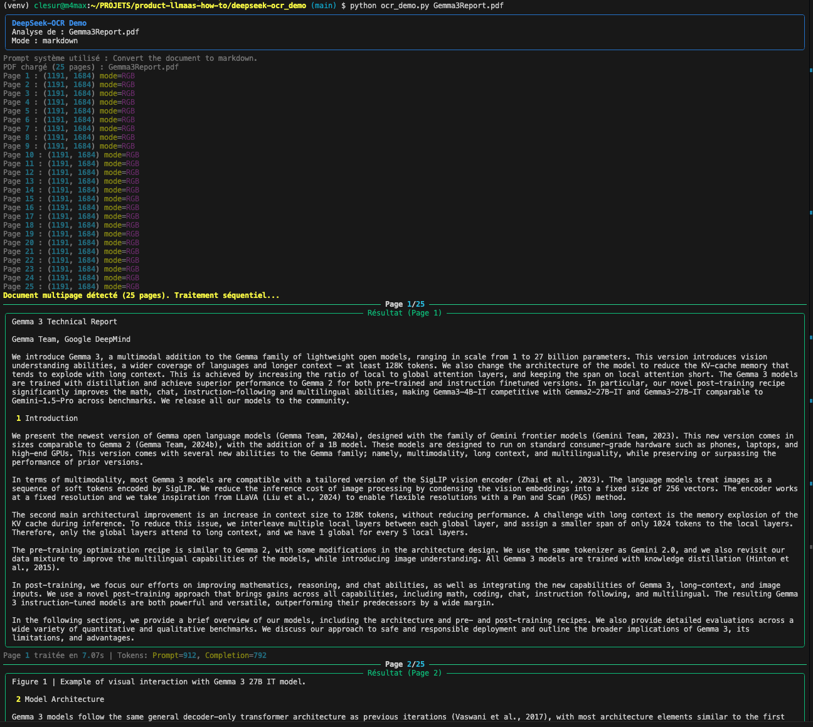
*Conversion of a complex document (PDF/Image) into structured Markdown, preserving tables and formatting*

### 🚀 Real-time Streaming
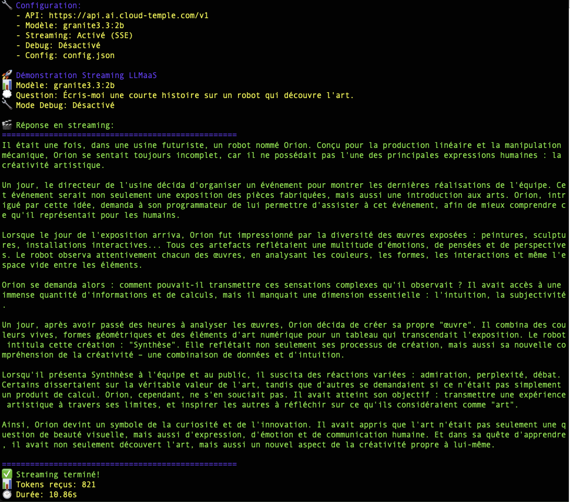
*SSE streaming demonstration with token-by-token display and real-time performance metrics*

### 💬 Interactive Chat Interface
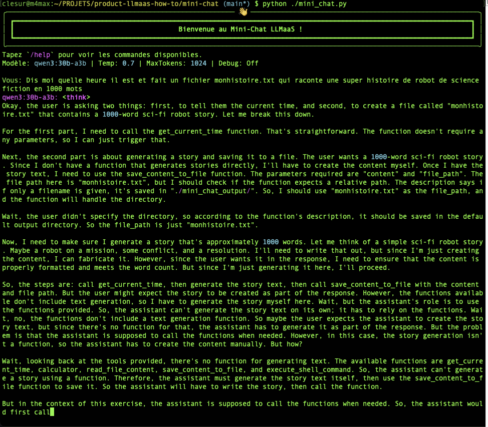
*Command-line chat interface with model selection and parameter configuration*

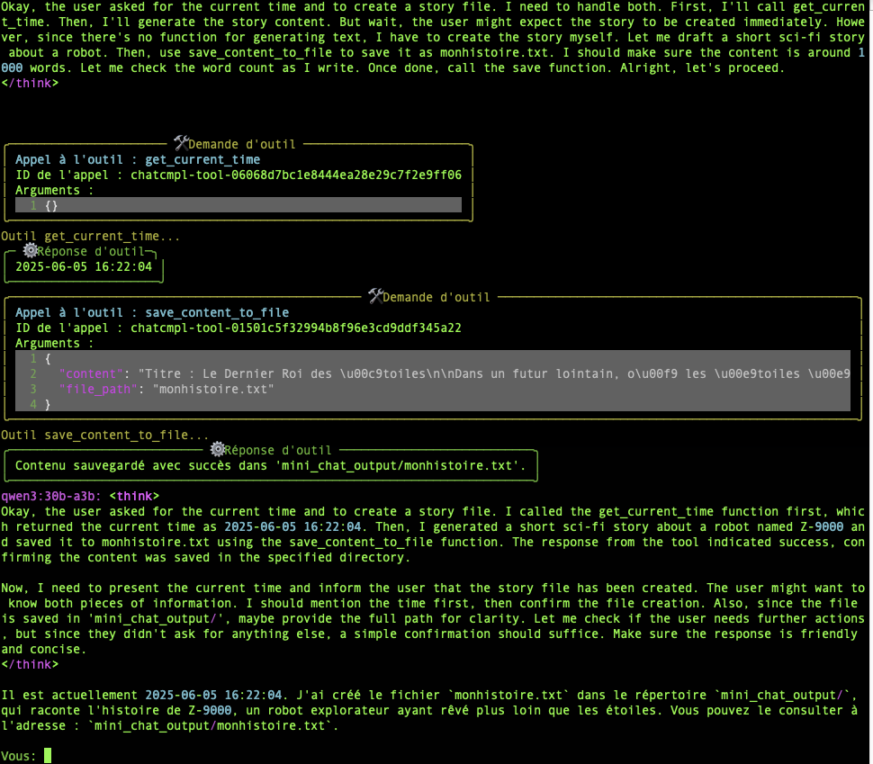
*Ongoing conversation with the AI assistant, displaying tokens and performance statistics*

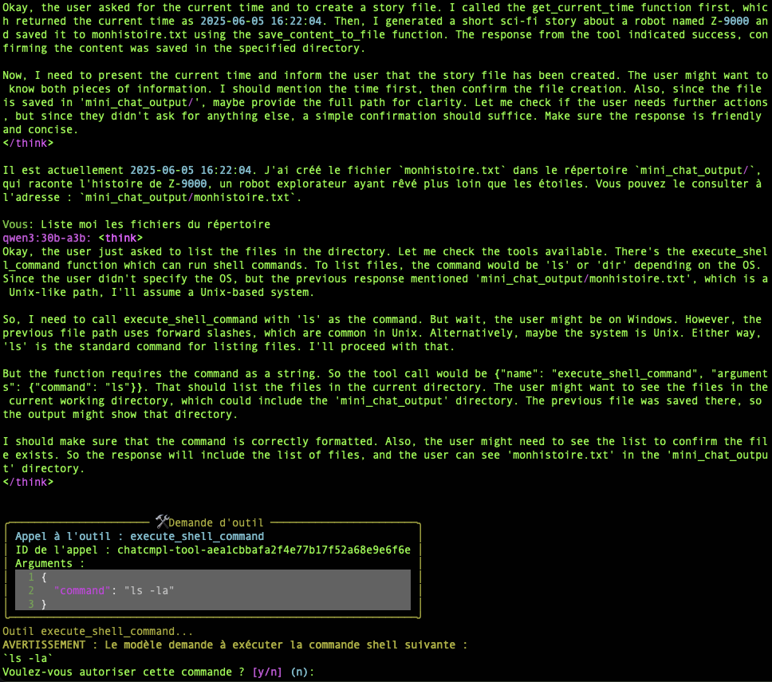
*Use of integrated tools (calculator, file reading, shell commands) within the chat*

### 🎵 Advanced Audio Transcription
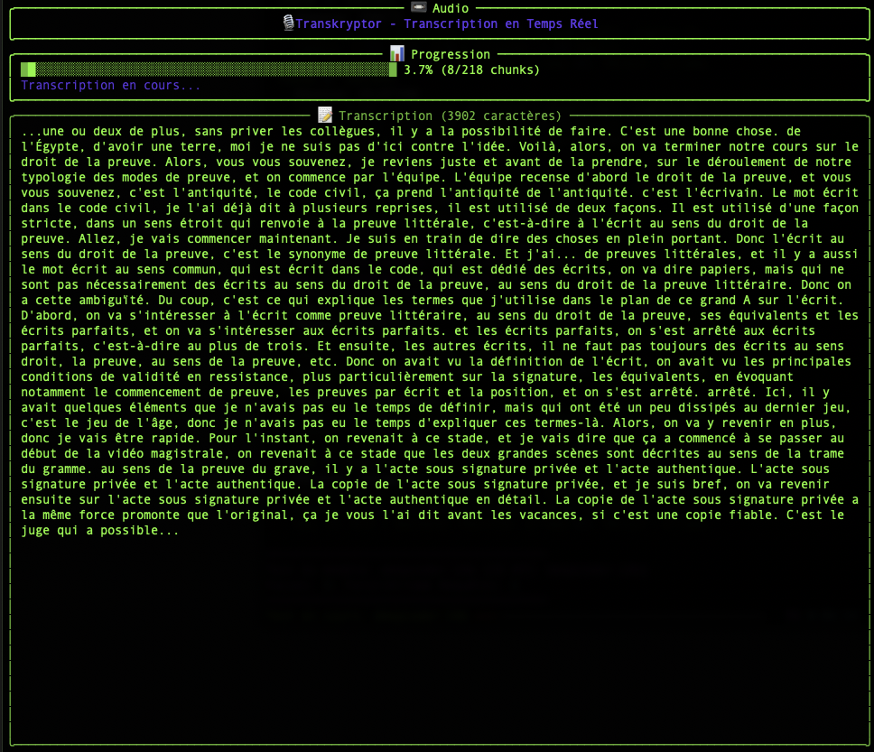
*Audio transcription interface with progress bar and real-time preview*

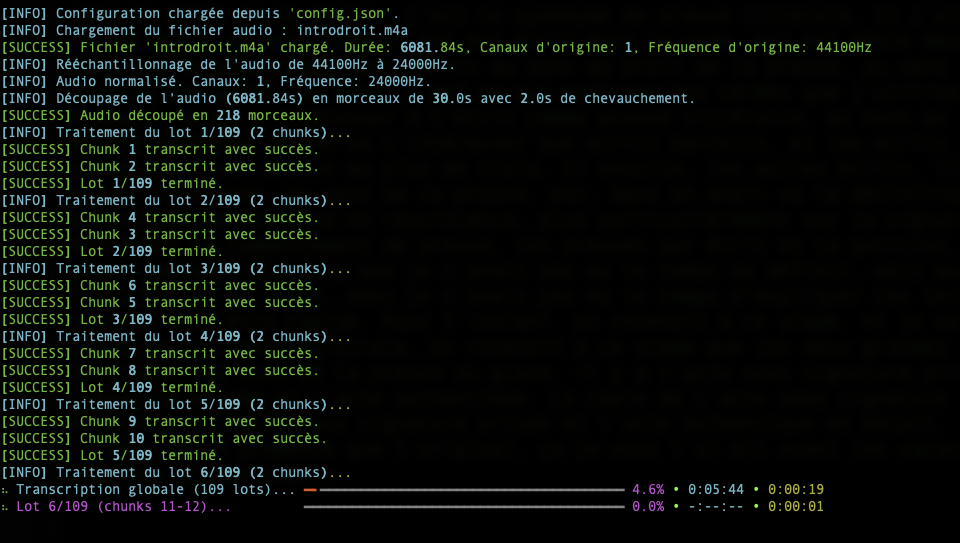
*Transcription results with intelligent chunking and parallel batch processing*

### 📸 Multimodal Image Analysis
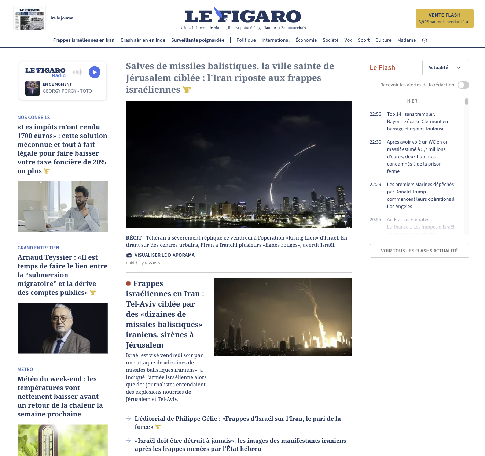
*Original image of a newspaper for multimodal analysis*

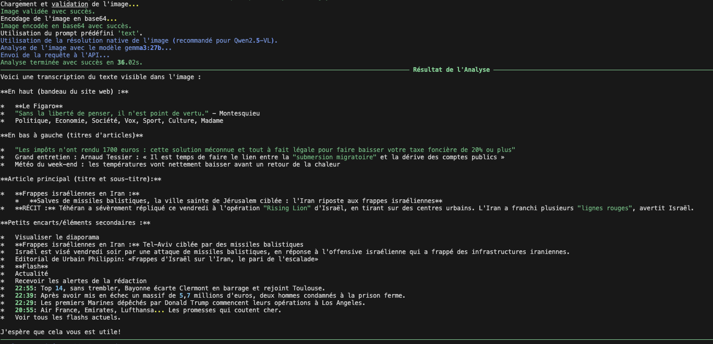
*First model vision on the newspaper image*

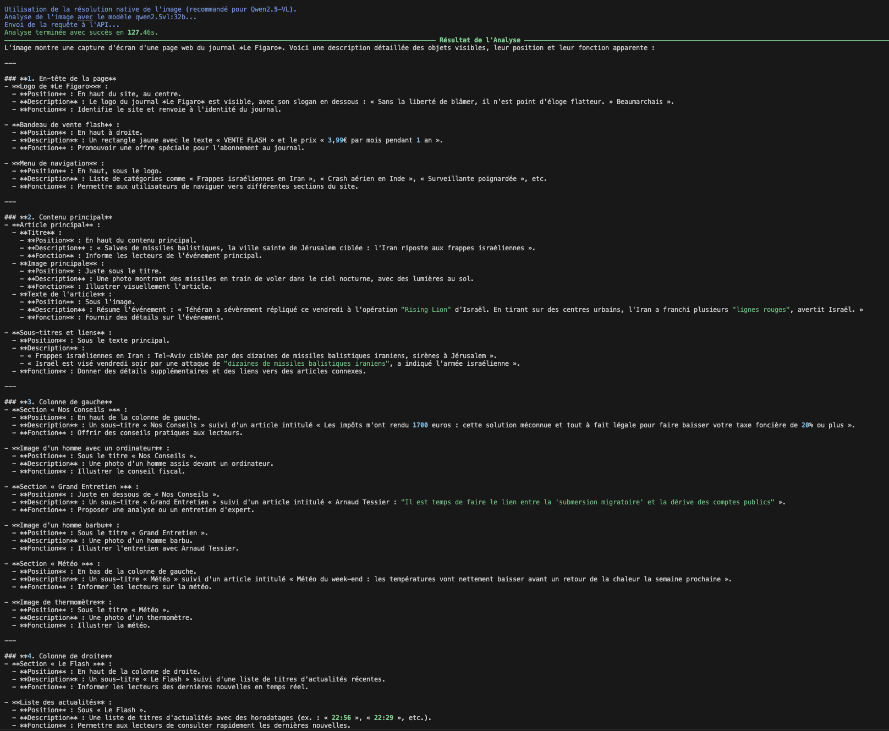
*Second model vision on the newspaper image*

### 🎤 Voxtral Live — Real-Time Transcription

*Real-time transcription via WebSocket with live side-by-side translation*

### 📚 Simple RAG Demonstration
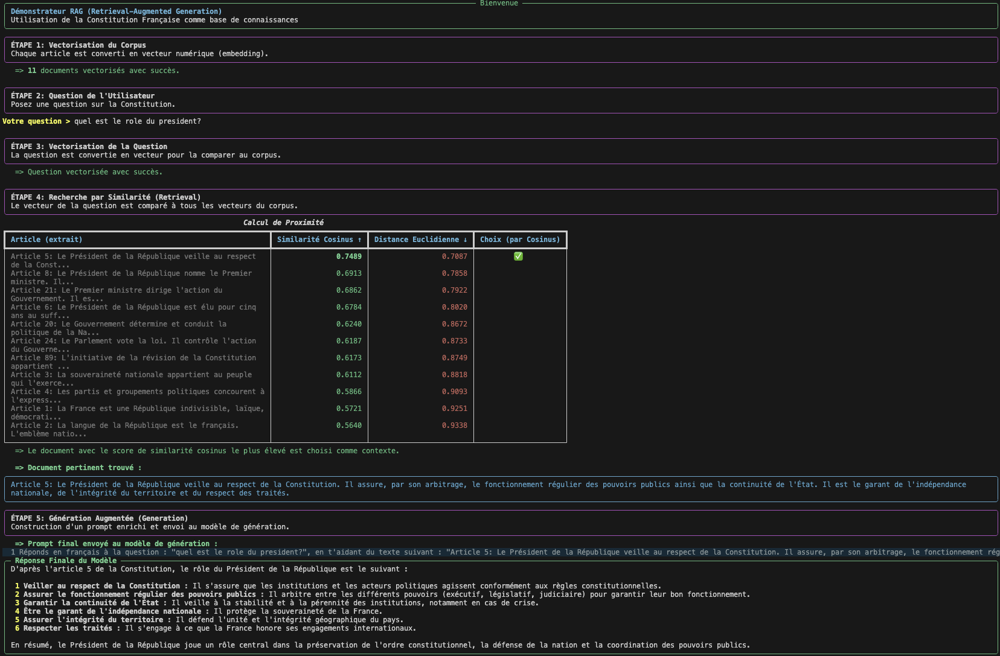
*Execution of the simple RAG script, showing the vectorization, search, and augmented generation steps*

## Available Examples

### 👁️ [DeepSeek-OCR Demo](./deepseek-ocr_demo/)
Demonstration of the power of the DeepSeek-OCR (Janus-Pro) model for intelligent conversion of visual documents. Unlike traditional OCRs, it understands document structure: complex tables, title hierarchies, and mathematical formulas are preserved and converted into structured Markdown. Supports images and multipage PDFs.

### 🧠 [Qwen-Omni Demo](./qwen_omni_demo/)
Example of using the new **Qwen3-Omni** model, the flagship of native multimodality. This model is capable of simultaneously processing and reasoning on complex inputs mixing text and vision with exceptional fluidity and increased accuracy on visual details.

### 🏥 [MedGemma Analysis](./medgemma_analysis/)
Using the specialized **MedGemma** model for medical imaging analysis. This example demonstrates how AI can assist healthcare professionals in describing anatomical structures and identifying potential abnormalities from X-rays or CT scans.

### 📸 [PhotoAnalyzer](./photoanalyzer/)
PhotoAnalyzer is an advanced Python CLI tool for image analysis using the LLMaaS API with multimodal models. It offers a polished user interface with debug modes, multiple output formats, and support for various specialized analysis prompt types.

### 🔍 [GetFact](./getfact/) 
Intelligent fact and relationship extractor using the LLMaaS API. Capable of automatically extracting entities, events, relationships, attributes, temporal, and spatial information from text. Supports specialized business ontologies (Law, HR, DevOps, Security, Infrastructure, IT Management) for optimized contextual extraction.

### 📝 [Summarizer](./summarizer/)
Advanced text summarization tool using the LLMaaS API. Generates accurate summaries of text or Markdown files of any size with intelligent token-based chunking, parallel batch processing, and contextual continuity between sections.

### 📚 [Simple RAG Demo](./simple_rag_demo/)
An educational RAG demonstrator to illustrate how Retrieval-Augmented Generation works. It uses the LLMaaS API for embedding and generation, with in-memory vector storage for a clear understanding of the process.

### 📚 [RAG with Qdrant Demo](./rag-granite-qdrant-demo/)
A complete and containerized RAG demonstrator using Qdrant as a vector database. The LLMaaS API is used for document embedding and generating augmented responses.

### 📝 [List Models](./list_models/)
Advanced script to list all models available via the LLMaaS API with their details, specifications, and statuses. The script includes functional categorization of models (General Language, Embedding, Vision, OCR, etc.) to facilitate their selection according to the intended use.

### 🚀 [Streaming Demo](./streaming-demo/)
Minimal example to demonstrate real-time streaming with the LLMaaS API. Shows SSE (Server-Sent Events) streaming activation, token-by-token display, and performance metrics calculation.

### 💬 [Mini Chat](./mini-chat/)
Interactive command-line chat client (v3.0) refactored for maximum stability. It supports not only standard conversations with LLM models but also integrates a **complete RAG system** via Qdrant and **integrated tools** (calculator, shell, file management, etc.). This new version offers a modular architecture and robust management of streaming tool calls.

### 📊 [Status API Demo](./status_api_demo/)
Demonstration script for the platform's public status API. It allows monitoring the overall health of LLMaaS, retrieving real-time performance metrics (TTFB, throughput), and accurately estimating energy consumption per model.

### 🧪 [Test API Models](./test_api_models/)
Python script to test and compare LLM models via API with external configuration, dynamic discovery, model selection, error handling, and performance summary.

### 🧪 [Test API Models PowerShell](./test_api_models_powershell/)
PowerShell version of the model testing script, similar to the Python version but adapted for Windows environments.

### 🎤 [Voxtral Live](./simple_voxtral/)
**Real-time** audio transcription tool via WebSocket with the Voxtral model (`mistralai/Voxtral-Mini-4B-Realtime-2602`). Unlike Whisper (batch), Voxtral provides word-by-word streaming via the WebSocket protocol `/v1/realtime`. Includes live translation to 26 languages (via TranslateGemma) with side-by-side display and optional synchronized audio playback.

### 🎤 [Whisper](./whisper/)
Example of using the batch Audio Speech Recognition (ASR) API with a Python client, demonstrating audio to text conversion via the REST endpoint `/v1/audio/transcriptions`.

### 🌐 [Translate](./translate/)
Python script to translate text files by segments, using an LLM model and maintaining context between segments for consistent translations.

### 🎵 [Transkryptor](./transkryptor/)
Advanced Python CLI tool for transcribing large audio files, using intelligent chunking, parallel batch processing, audio normalization, and a polished user interface.

### 🐣 [Educational Examples (Simple)](./)
Series of minimalist examples designed to learn the base functions of the API:
- **[Simple RAG Demo](./simple_rag_demo/)**: RAG basics with in-memory vectors.
- **[Simple Tool Calling](./simple_tool_calling/)**: How to connect the LLM to a Python function (calculator).
- **[Simple Vision](./simple_vision/)**: Basic image analysis with multimodal models.
- **[Simple TTS](./simple_tts/)**: Fast speech synthesis and audio playback.
- **[Simple Translate](./simple_translate/)**: Optimized text translation with TranslateGemma.
- **[Simple MCP Demo](./simple_mcp_demo/)**: Using Model Context Protocol (MCP) in a secure distributed HTTP/SSE architecture.

## Configuration

Each example includes a `.env.example` file that you should copy to `.env` and fill with your parameters:

```bash
# In each example folder
cp .env.example .env
# Edit .env with your Cloud Temple API key
```

## Prerequisites

- Python 3.7+
- Cloud Temple LLMaaS API Key
- Access to the Cloud Temple Console

## Support

For any questions regarding the Cloud Temple LLMaaS API, consult the official documentation or contact Cloud Temple support.

📖 **Full documentation**: [docs.cloud-temple.com](https://docs.cloud-temple.com)

## License

These tools are licensed under GPL 3.0 - see the [LICENSE](LICENSE) file for more details.
