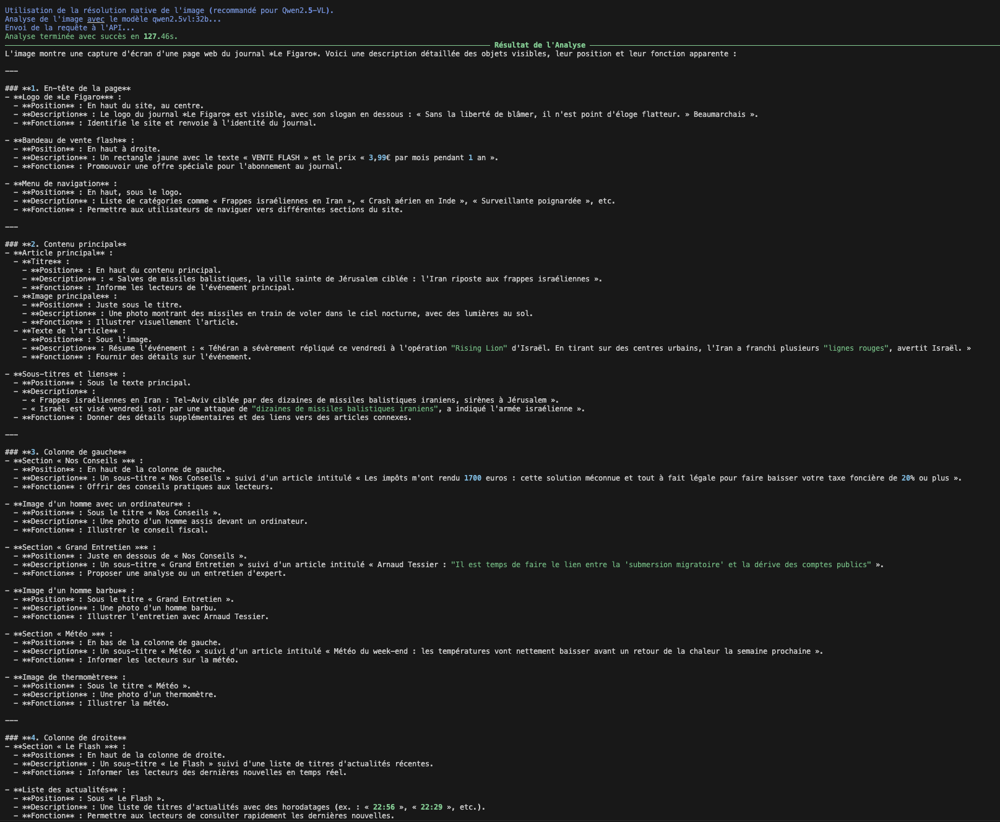

# LLM as a Service (LLMaaS) Use Cases - Cloud Temple

This repository contains a collection of code examples and scripts demonstrating the various features and use cases of **Cloud Temple's LLM as a Service (LLMaaS) offering**.

## 🆕 Changelog - Latest Updates

### Version 2.1.0 - June 2025

#### 🔍 **GetFact - Fact Extractor**
- ✨ **Reasoning Model Support**: Automatic handling of responses including thinking blocks (`<think>...</think>`)
- 🛠️ **Robust JSON Parsing**: Reliable extraction of JSON content even from malformed responses
- 🐛 **Advanced Debug Mode**: Detailed logs including precise chunking, complete JSON payloads, and raw API responses

#### 🎵 **Transkryptor - Audio Transcription**
- 🔄 **Error Resilience**: Retry mechanism with exponential backoff for better stability
- ✨ **Transcription Refinement (`--rework`)**: New option to improve transcription via a language model
- 📄 **`rework-only.py` Script**: New dedicated script to refine existing text files
- 🔗 **Continuous Context (`--rework-follow`)**: Context maintenance between batches for better coherence
- 📊 **Quality Recommendations**: Optimal configuration based on testing (20s for complex content, 10s for dialogues)
- 📦 **Extended Dependencies**: Addition of `tiktoken` and `langchain-text-splitters` for better chunking

#### 📝 **Summarizer - Text Summarization** ✨ *NEW TOOL*
- 🆕 **Complete summarization tool**: New script to generate accurate summaries of text or Markdown files of any size
- 🧩 **Intelligent token-based chunking**: Uses `tiktoken` for precise chunking respecting model limits
- ⚡ **Parallel batch processing**: Speed optimization with simultaneous chunk processing
- 🔗 **Contextual continuity**: Context maintenance between sections for coherent synthesis
- 📝 **Configurable prompts**: Support for different summary types (concise, detailed, action items, Q&A)
- 📖 **Complete documentation**: French and English README with detailed usage examples

#### 📚 **RAG (Retrieval-Augmented Generation) Examples** ✨ *NEW EXAMPLES*
- 🆕 **Simple RAG Demo**: An educational script to understand the basic mechanics of RAG with in-memory vectors.
- 🆕 **RAG with Qdrant Demo**: A complete and containerized example using Qdrant as a vector database for more robust RAG applications.

---

## About Cloud Temple LLMaaS

Cloud Temple's LLMaaS API allows you to easily integrate language models into your applications. It is accessible via the Cloud Temple Console where you can manage your API keys, monitor your consumption, and configure your settings.

### Quick API Access

- **Base URL**: `https://api.ai.cloud-temple.com/v1/`
- **Authentication**: `Authorization: Bearer YOUR_API_KEY` Header
- **Format**: JSON (`Content-Type: application/json`)

### Main Endpoints

- `/chat/completions`: Conversational response generation
- `/completions`: Simple text completion
- `/models`: List of available models

### cURL Request Example

```bash
curl -X POST "https://api.ai.cloud-temple.com/v1/chat/completions" \
  -H "Content-Type: application/json" \
  -H "Authorization: Bearer YOUR_API_KEY" \
  -d '{
    "model": "granite3.3:8b",
    "messages": [
      {
        "role": "user", 
        "content": "Hello! Can you introduce yourself in French?"
      }
    ],
    "max_tokens": 200,
    "temperature": 0.7
  }'
```

### Available Parameters

| Parameter     | Type    | Description                               |
| ------------- | ------- | ----------------------------------------- |
| `model`       | string  | The model to use                          |
| `messages`    | array   | List of conversation messages             |
| `max_tokens`  | integer | Maximum number of tokens to generate      |
| `temperature` | float   | Controls creativity (0.0-2.0)             |
| `top_p`       | float   | Controls response diversity               |
| `stream`      | boolean | Activates response streaming              |
| `user`        | string  | Unique identifier for the end-user        |

## Examples Structure

Each example is organized in its own subdirectory with:
- A README.md file explaining the objective and functionality
- Necessary source code files
- Configuration files (`.env.example`, `config.example.json`)
- Example data if applicable

## 📸 Visual Overview

Discover the capabilities of the Cloud Temple LLMaaS API through these screenshots of the examples in action:

### 🚀 Real-time Streaming

*SSE streaming demonstration with token-by-token display and real-time performance metrics*

### 💬 Interactive Chat Interface

*Command-line chat interface with model selection and parameter configuration*


*Ongoing conversation with the AI assistant, displaying tokens and performance statistics*


*Use of integrated tools (calculator, file reading, shell commands) within the chat*

### 🎵 Advanced Audio Transcription

*Audio transcription interface with progress bar and real-time preview*


*Transcription results with intelligent chunking and parallel batch processing*

### 📸 Multimodal Image Analysis

*Original image of a newspaper for multimodal analysis*


*First model vision on the newspaper image*


*Second model vision on the newspaper image*

## Available Examples

### 📸 [PhotoAnalyzer](./photoanalyzer/)
PhotoAnalyzer is an advanced Python CLI tool for image analysis using the LLMaaS API with multimodal models. It offers a polished user interface with debug modes, multiple output formats, and support for various specialized analysis prompt types.

### 🔍 [GetFact](./getfact/) 
Intelligent fact and relationship extractor using the LLMaaS API. Capable of automatically extracting entities, events, relationships, attributes, temporal, and spatial information from text. Supports specialized business ontologies (Law, HR, DevOps, Security, Infrastructure, IT Management) for optimized contextual extraction.

### 📝 [Summarizer](./summarizer/)
Advanced text summarization tool using the LLMaaS API. Generates accurate summaries of text or Markdown files of any size with intelligent token-based chunking, parallel batch processing, and contextual continuity between sections.

### 📚 [Simple RAG Demo](./simple_rag_demo/)
An educational RAG demonstrator to illustrate how Retrieval-Augmented Generation works. It uses the LLMaaS API for embedding and generation, with in-memory vector storage for a clear understanding of the process.

### 📚 [RAG with Qdrant Demo](./rag-granite-qdrant-demo/)
A complete and containerized RAG demonstrator using Qdrant as a vector database. The LLMaaS API is used for document embedding and generating augmented responses.

### 📝 [List Models](./list_models/)
Simple script to list all models available via the LLMaaS API with their details, specifications, and statuses.

### 🚀 [Streaming Demo](./streaming-demo/)
Minimal example to demonstrate real-time streaming with the LLMaaS API. Shows SSE (Server-Sent Events) streaming activation, token-by-token display, and performance metrics calculation.

### 💬 [Mini Chat](./mini-chat/)
Interactive command-line chat client to converse with LLM models, supporting history, system prompts, session saving/loading, and tool usage.

### 🧪 [Test API Models](./test_api_models/)
Python script to test and compare LLM models via API with external configuration, dynamic discovery, model selection, error handling, and performance summary.

### 🧪 [Test API Models PowerShell](./test_api_models_powershell/)
PowerShell version of the model testing script, similar to the Python version but adapted for Windows environments.

### 🎤 [Whisper](./whisper/)
Example of using the Audio Speech Recognition (ASR) API with a Python client, demonstrating audio to text conversion.

### 🌐 [Translate](./translate/)
Python script to translate text files by segments, using an LLM model and maintaining context between segments for consistent translations.

### 🎵 [Transkryptor](./transkryptor/)
Advanced Python CLI tool for transcribing large audio files, using intelligent chunking, parallel batch processing, audio normalization, and a polished user interface.

## Configuration

Each example includes a `.env.example` file that you should copy to `.env` and fill with your parameters:

```bash
# In each example folder
cp .env.example .env
# Edit .env with your Cloud Temple API key
```

## Prerequisites

- Python 3.7+
- Cloud Temple LLMaaS API Key
- Access to the Cloud Temple Console

## Support

For any questions regarding the Cloud Temple LLMaaS API, consult the official documentation or contact Cloud Temple support.

📖 **Full documentation**: [docs.cloud-temple.com](https://docs.cloud-temple.com)

## License

These tools are licensed under GPL 3.0 - see the [LICENSE](LICENSE) file for more details.
