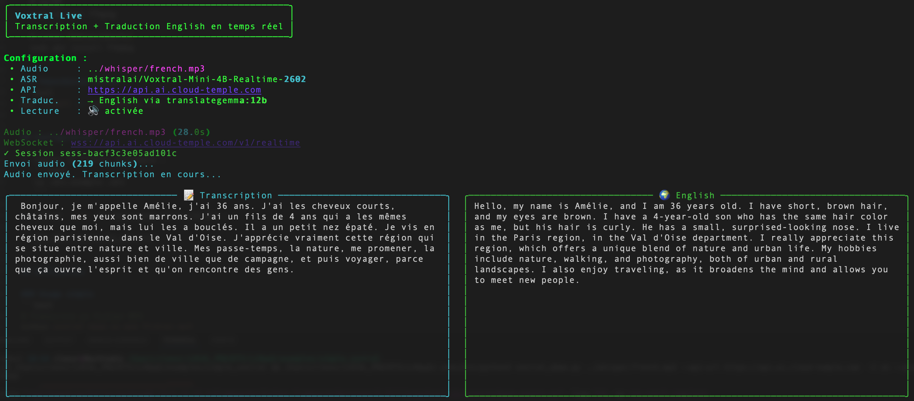

# 🎤 Voxtral Live — Transcription + Traduction Audio Temps Réel

Outil de démonstration pour **Voxtral** (`mistralai/Voxtral-Mini-4B-Realtime-2602`), le modèle de transcription audio temps réel (ASR) de la plateforme LLMaaS.

**Fonctionnalités :**
- 📝 **Transcription temps réel** via WebSocket (streaming mot par mot)
- 🌍 **Traduction live** vers 26 langues (via TranslateGemma, en parallèle de la transcription)
- 🔊 **Lecture audio synchronisée** (optionnelle, l'audio démarre au premier mot transcrit)
- 📊 **Affichage côte à côte** avec panneaux Rich (Transcription | Traduction)

## Voxtral vs Whisper : quelle différence ?

| Caractéristique | Whisper (Batch)                  | Voxtral (Realtime)       |
| --------------- | -------------------------------- | ------------------------ |
| **Endpoint**    | `POST /v1/audio/transcriptions`  | WebSocket `/v1/realtime` |
| **Protocole**   | HTTP REST classique              | WebSocket bidirectionnel |
| **Latence**     | Réponse après traitement complet | Streaming mot par mot    |
| **Cas d'usage** | Fichiers audio complets          | Transcription en direct  |

## Prérequis

### Système
- **Python 3.9+**
- **ffmpeg** installé sur le système :
  ```bash
  # macOS
  brew install ffmpeg

  # Linux (Debian/Ubuntu)
  sudo apt install ffmpeg
  ```

### Dépendances Python
```bash
pip install -r requirements.txt
```

Les dépendances incluent : `websockets` (client WebSocket), `pydub` (conversion audio), `httpx` (traduction streaming), `rich` (affichage console), `python-dotenv` (configuration).

## Configuration

1. Copiez le fichier d'exemple :
   ```bash
   cp .env.example .env
   ```

2. Éditez `.env` et renseignez votre clé API :
   ```
   API_KEY="votre_cle_api_ici"
   ```

## Utilisation

### Transcription seule
```bash
python voxtral_demo.py mon_fichier.mp3
```

### Transcription + Traduction live
```bash
# Traduire en anglais en temps réel
python voxtral_demo.py audio.mp3 -t en

# Traduire en allemand
python voxtral_demo.py audio.mp3 -t de

# Traduire en espagnol avec un modèle spécifique
python voxtral_demo.py audio.mp3 -t es --translate-model translategemma:27b
```

### Avec lecture audio synchronisée
```bash
# Transcrire + traduire + écouter l'audio en même temps
python voxtral_demo.py audio.mp3 -t en --play
```

### Autres options
```bash
# Sauvegarder le résultat (transcription + traduction) dans un fichier
python voxtral_demo.py audio.mp3 -t en -o resultat.txt

# Mode debug
python voxtral_demo.py audio.mp3 --debug

# Spécifier la clé API en ligne de commande
python voxtral_demo.py audio.mp3 --api-key MA_CLE_API
```

## Options de la CLI

| Option                 | Description                                              | Défaut                                    |
| ---------------------- | -------------------------------------------------------- | ----------------------------------------- |
| `audio`                | Fichier audio à transcrire                               | *(obligatoire)*                           |
| `-m, --model`          | Modèle Voxtral (ASR)                                     | `mistralai/Voxtral-Mini-4B-Realtime-2602` |
| `-t, --translate LANG` | Traduire vers une langue (ex: `en`, `de`, `es`, `ja`...) | *(désactivé)*                             |
| `--translate-model`    | Modèle de traduction                                     | `translategemma:12b`                      |
| `--source-lang`        | Langue source (auto-détecté si absent)                   | *(auto)*                                  |
| `-p, --play`           | Jouer l'audio en parallèle de la transcription           | *(désactivé)*                             |
| `-o, --output`         | Fichier de sortie texte                                  | *(aucun)*                                 |
| `--api-url`            | URL de l'API                                             | `https://api.ai.cloud-temple.com`         |
| `--api-key`            | Clé API Bearer                                           | depuis `.env`                             |
| `--chunk-size`         | Taille des chunks audio (octets)                         | `4096`                                    |
| `--debug`              | Afficher les messages WebSocket bruts                    | *(désactivé)*                             |

### Langues de traduction supportées

`en` anglais, `fr` français, `de` allemand, `es` espagnol, `it` italien, `pt` portugais, `nl` néerlandais, `pl` polonais, `ru` russe, `zh` chinois, `ja` japonais, `ko` coréen, `ar` arabe, `tr` turc, `uk` ukrainien, `vi` vietnamien, `th` thaï, `hi` hindi, `sv` suédois, `da` danois, `no` norvégien, `fi` finnois, `cs` tchèque, `ro` roumain, `hu` hongrois, `el` grec, `he` hébreu.

## Protocole WebSocket

Le script implémente le protocole suivant :

```
Client                              Serveur (Voxtral)
  │                                      │
  │──── Connexion WebSocket ────────────>│
  │<──── session.created ────────────────│
  │                                      │
  │──── session.update (model) ─────────>│
  │──── input_audio_buffer.commit ──────>│
  │                                      │
  │──── input_audio_buffer.append ──────>│  ─┐
  │──── input_audio_buffer.append ──────>│   │ Envoi audio
  │──── input_audio_buffer.append ──────>│   │ chunk par chunk
  │──── ...                     ────────>│  ─┘
  │                                      │
  │──── input_audio_buffer.commit ──────>│  (final=True)
  │      (final=True)                    │
  │                                      │
  │<──── transcription.delta ────────────│  ─┐
  │<──── transcription.delta ────────────│   │ Streaming
  │<──── transcription.delta ────────────│   │ mot par mot
  │<──── ...                 ────────────│  ─┘
  │                                      │
  │<──── transcription.done  ────────────│  (avec usage)
  │                                      │
  │──── Fermeture ──────────────────────>│
```

En parallèle, chaque fin de phrase détectée dans la transcription déclenche une traduction streaming (si `-t` activé) via l'API `/v1/chat/completions` avec le modèle TranslateGemma.

## Format audio

L'audio est converti automatiquement par le script en :
- **Fréquence** : 16 kHz
- **Canaux** : Mono
- **Format** : PCM 16-bit (signé, little-endian)
- **Encodage** : Base64 pour la transmission WebSocket

Les formats d'entrée supportés incluent : MP3, WAV, OGG, FLAC, M4A, AAC, et tout format supporté par ffmpeg.

## 📸 Aperçu


*Transcription temps réel via WebSocket avec traduction live côte à côte*

## Exemple de sortie

Voici un exemple réel d'exécution avec traduction en anglais et lecture audio :

```bash
python voxtral_demo.py ../whisper/french.mp3 -t en --play
```

L'interface se décompose en plusieurs zones affichées dans le terminal :

### 1. En-tête et configuration

```
╭───────────────────────────────────────────────────╮
│ Voxtral Live                                      │
│ Transcription + Traduction English en temps réel  │
╰───────────────────────────────────────────────────╯

Configuration :
 • Audio     : ../whisper/french.mp3
 • ASR       : mistralai/Voxtral-Mini-4B-Realtime-2602
 • API       : https://api.ai.cloud-temple.com
 • Traduc.   : → English via translategemma:12b
 • Lecture   : 🔊 activée
```

### 2. Connexion et envoi

```
Audio : ../whisper/french.mp3 (28.0s)
WebSocket : wss://api.ai.cloud-temple.com/v1/realtime
✓ Session sess-bacf3c3e05ad101c
Envoi audio (219 chunks)...
Audio envoyé. Transcription en cours...
```

### 3. Panneaux côte à côte (temps réel)

Le cœur de l'affichage : deux panneaux Rich s'actualisent en continu.
- **📝 Transcription** (bordure cyan, à gauche) : le texte transcrit apparaît mot par mot
- **🌍 Traduction** (bordure verte, à droite) : la traduction arrive phrase par phrase, en parallèle

```
╭──────────── 📝 Transcription ──────────────────╮╭─────────────── 🌍 English ────────────────────╮
│                                                ││                                               │
│  Bonjour, je m'appelle Amélie, j'ai 36 ans.   ││  Hello, my name is Amélie, and I am 36 years  │
│  J'ai les cheveux courts, châtains, mes yeux   ││  old. I have short, brown hair, and my eyes    │
│  sont marrons. J'ai un fils de 4 ans qui a     ││  are brown. I have a 4-year-old son who has    │
│  les mêmes cheveux que moi, mais lui les a     ││  the same hair color as me, but his hair is    │
│  bouclés. Il a un petit nez épaté. Je vis en   ││  curly. He has a small, surprised-looking      │
│  région parisienne, dans le Val d'Oise.        ││  nose. I live in the Paris region, in the Val  │
│  J'apprécie vraiment cette région qui se situe ││  d'Oise department. I really appreciate this   │
│  entre nature et ville. Mes passe-temps, la    ││  region, which offers a unique blend of nature │
│  nature, me promener, la photographie, aussi   ││  and urban life. My hobbies include nature,    │
│  bien de ville que de campagne, et puis        ││  walking, and photography, both of urban and   │
│  voyager, parce que ça ouvre l'esprit et qu'on ││  rural landscapes. I also enjoy traveling, as  │
│  rencontre des gens.                           ││  it broadens the mind and allows you to meet   │
│                                                ││  new people.                                   │
│                                                ││                                               │
╰────────────────────────────────────────────────╯╰───────────────────────────────────────────────╯
```

### 4. Résultat final

Une fois la transcription et toutes les traductions terminées :

```
                    Résultat Final
┌──────────────────┬───────────────────────────────────────────────────┐
│ 📝 Transcription │ Bonjour, je m'appelle Amélie, j'ai 36 ans. J'ai │
│                  │ les cheveux courts, châtains, mes yeux sont...   │
│ 🌍 Traduction    │ Hello, my name is Amélie, and I am 36 years     │
│                  │ old. I have short, brown hair, and my eyes...    │
│ ⏱ Durée          │ 14.52s                                          │
│ Tokens           │ prompt=1234 completion=56                        │
└──────────────────┴───────────────────────────────────────────────────┘
```

## Alias de modèle

Vous pouvez utiliser les alias configurés sur la plateforme :

```bash
# Nom complet
python voxtral_demo.py audio.mp3 -m "mistralai/Voxtral-Mini-4B-Realtime-2602"

# Alias
python voxtral_demo.py audio.mp3 -m "voxtral"
python voxtral_demo.py audio.mp3 -m "asr-realtime"
```
